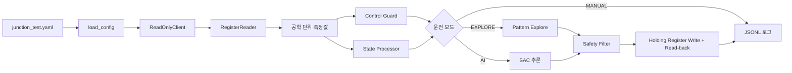
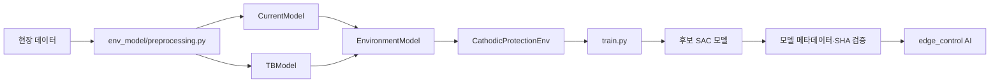

# 코드 구조와 읽는 순서

이 문서는 파일을 처음 열었을 때 “이 코드가 어느 단계에서 왜 호출되는가”를 파악하기 위한 안내다. 주소·전압 범위·운전 주기 같은 장비별 값은 Python 코드가 아니라 YAML 설정에서 관리한다.

## 먼저 읽을 파일

1. [junction_test.yaml](../edge_control/configs/junction_test.yaml): 현재 시험 장비의 레지스터, 운전 범위, Write 간격
2. [edge_control/src/main.py](../edge_control/src/main.py): 한 제어 주기를 조립하는 실행 진입점
3. [control_guard.py](../edge_control/src/controller/control_guard.py): 어떤 상태에서 제어와 Write를 허용하는지
4. [state_processor.py](../edge_control/src/state/state_processor.py): 읽은 값에서 4차원 AI State를 만드는 방법
5. [ai_controller.py](../edge_control/src/controller/ai_controller.py) 또는 [explore_controller.py](../edge_control/src/controller/explore_controller.py): 모드별 Action 생성
6. [shared/control_core/safety_filter.py](../shared/control_core/safety_filter.py): 공통 전압 제한 규칙

## edge_control의 한 제어 주기

`main.run()`은 위 과정을 polling 주기마다 반복한다. 읽기 실패나 TB 비정상 상태에서는 `ControlGuard`가 Action과 Write를 막고, 이전 주기의 값은 사용하지 않는다.

| 폴더 | 역할 |
|---|---|
| `edge_control/src/communication` | Modbus TCP 연결, 레지스터 읽기, 제어값 Write와 Read-back |
| `edge_control/src/controller` | MANUAL/EXPLORE/AI 분기, Safety Filter 적용, 제어 경계 복구 |
| `edge_control/src/state` | 현장 값에서 TB trend를 포함한 정책 State 구성 |
| `shared/control_core` | 학습과 edge가 반드시 동일하게 써야 하는 State, 정규화, Safety Filter, 모델 메타데이터 검사 |

### 모드별 동작

| 모드 | Action 생성 | Write |
|---|---|---|
| `MANUAL` | 하지 않음 | 하지 않음 |
| `EXPLORE` | 설정된 `up_down` 또는 `hold` 패턴 | Guard·간격·`write_enabled`가 모두 허용할 때만 |
| `AI` | SAC 정책의 `[-1, 1]` Action을 전압 변화량으로 변환 | Shadow Mode가 아니고 Guard·간격·`write_enabled`가 모두 허용할 때만 |

AI와 EXPLORE 모두 현재 `control.explore.min_voltage`~`max_voltage` 범위를 사용하고, 범위 밖의 현재 설정전압은 다음 제어에서 가장 가까운 경계로 복구한다.

## 학습 코드의 흐름

| 폴더/파일 | 역할 |
|---|---|
| `cathodic_rl/env_model` | 데이터 기반 Current/TB 예측 모델과 이를 결합한 다음 상태 모델 |
| `cathodic_rl/env/cathodic_env.py` | Gymnasium 환경. DQN에는 3개 원시 State, SAC에는 정규화된 4개 State 제공 |
| `cathodic_rl/reward` | 학습할 때만 사용하는 Reward 계산 |
| `cathodic_rl/train.py` | SAC 재학습 결과를 기본적으로 후보 모델 경로에 저장 |
| `cathodic_rl/evaluation` | 정책 방향성과 포화 여부를 점검 |
| `cathodic_rl/analysis` | 자동 합격 판정이 아닌 환경·정책 진단 스크립트 |

`edge_control`은 Gymnasium 환경·환경모델을 import하지 않는다. edge에는 검증을 통과한 SAC 모델 파일과 메타데이터만 전달한다.

## 로그를 읽는 방법

JSONL의 한 줄은 한 제어 주기이며 시각은 한국 표준시(KST) 기준으로 초 단위까지 기록한다.

| 필드 | 의미 |
|---|---|
| `measurements` | 정류기 전압·전류·설정전압·TB 전위와 `tb_trend` 공학 단위 측정값 |
| `read_error` | 읽기 실패 시 실패한 논리 신호와 오류 메시지 |
| `states` | 코드 레지스터를 `REMOTE`, `ON`, `AI` 같은 이름으로 변환한 상태 |
| `control_action` | 모델 원본 Action, Safety Filter 결과, 목표 설정전압, 실제 Write 값 |
| `write_result` | Write 후 Read-back 일치 여부 |

상세 테스트 의미는 [TEST_GUIDE.md](TEST_GUIDE.md)를 참고한다.
